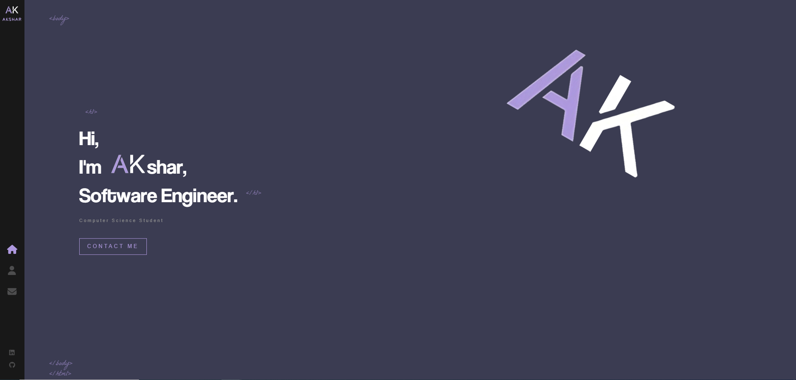
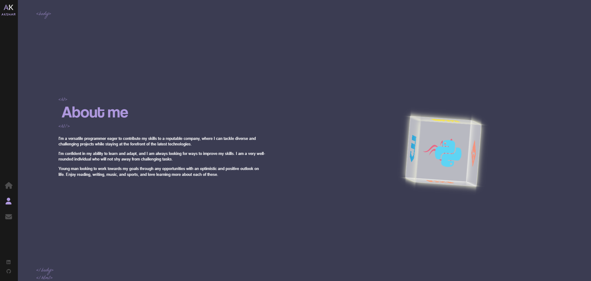

# Portfolio Website
Enjoy!

## How to run locally

1. Open in gitpod or locally
2. Download all npm packages necessary (dotenv, gh-pages, etc.)
3. Run: npm start
4. Enjoy!

### Homepage

### About Me

### Contact Me
